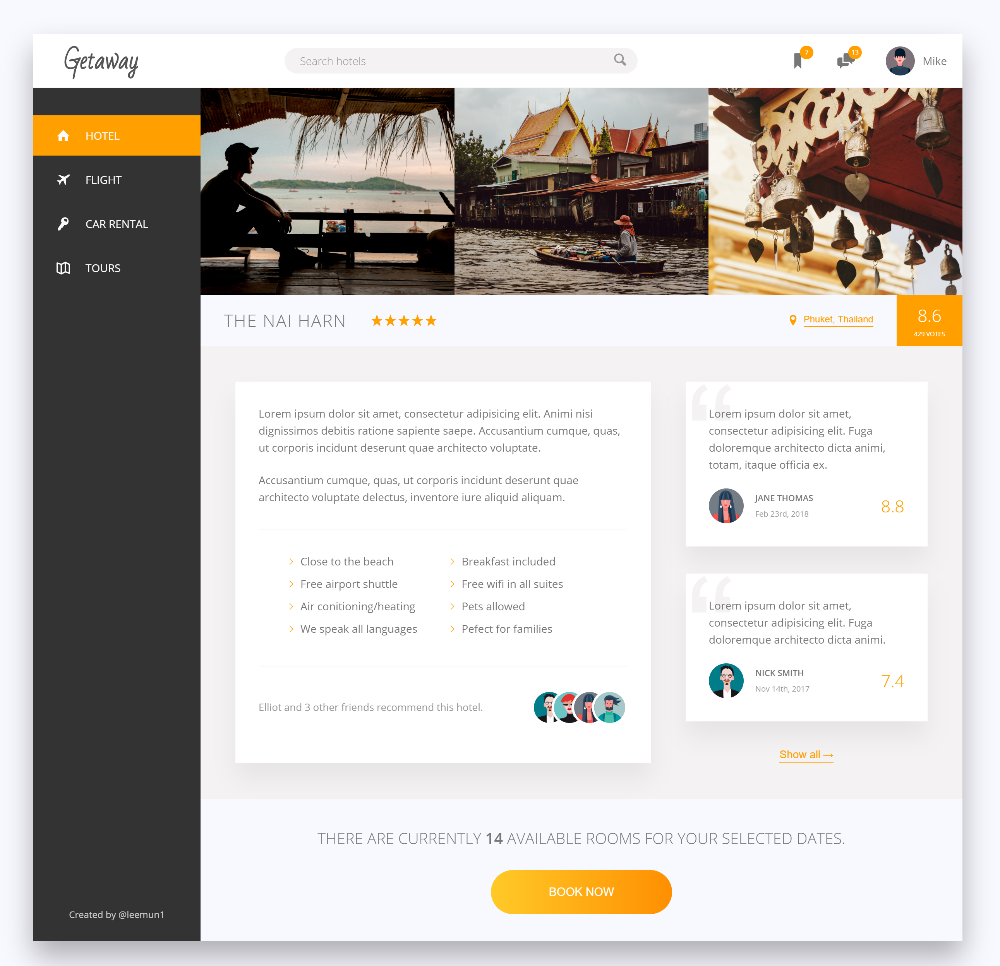

# Getaway

An application for searching hotels.

#### Check out the App here: [Live Preview](https://getaway-leemun1.herokuapp.com/)

This application was first created while taking the [Advanced CSS and Sass](https://www.udemy.com/advanced-css-and-sass/) course on Udemy. After I finished the course, I converted the static website into a React application.

## Made with

* React
* CSS (Sass)

## Future work

* Add additional views

## Setup

* `git clone git@github.com:leemun1/react-getaway-app.git`
* `cd react-getaway-app`
* `yarn install`
* `yarn start`
* visit [http://localhost:3000](http://localhost:3000)
